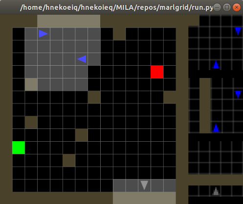
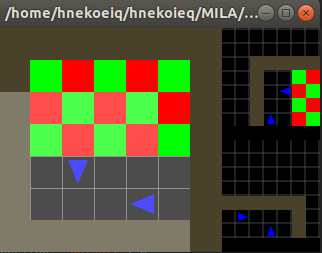
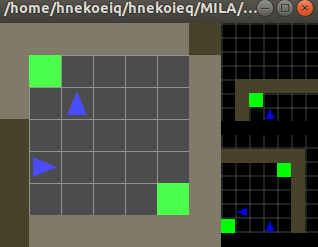
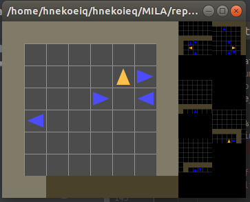

# Decentralized MarlGrid
Introducing more challenging tasks MARL experiments, based on [MiniGrid](https://github.com/maximecb/gym-minigrid).

<video src="https://kam.al/images/extra/cluttered_multigrid_example.mp4" id="spinning-video" controls preload loop style="width:400px; max-width:100%; display:block; margin-left:auto; margin-right:auto; margin-bottom:20px;"></video>

### Algorithms
- DDQN
- DDPG
- Rainbow
### Pre-built environment

MarlGrid comes with a few pre-built environments (see marlgrid/envs):
- `Checkers`

- `source_allocation`

- `pursuit_evasion`

- `doorkey`

